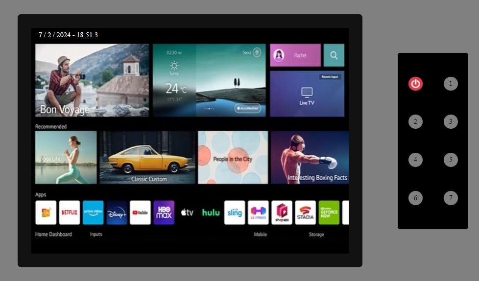

# TV interactiva
Segundo proyecto desarrollado en GeeksHubs Academy en el que disponemos de una TV y un mando para controlarla. Creado mediante HTML5, CSS3 y JavaScript.

## Tabla de contenido
- [Tecnologías.](#tecnologías)
- [Características.](#características)
- [Implantación en vivo.](#implantación-en-vivo)
- [Próximas mejoras](#próximas-mejoras)
- [Autor.](#autor)
- [Agradecimientos.](#agradecimientos)

### Tecnologías

### Características
- **Botón rojo** para encender y apagar.
- **7canales**.
- **Pantalla de inicio** al encender la tv.
- **Número del canal** en el que nos encontramos mostrado **en pantalla**.
- **Fecha y hora** en tiempo real mostrados en pantalla.
### Implantación en vivo
- 
### Próximas mejoras
- Introducción de botones para subir y bajar el **volumen**.
- Botones **CH+** y **CH-** para **cambiar los canales**.
### Autor
- **Víctor Blasco** - Project Developer.
   - [GitHub](https://github.com/VictorBlasco5)
### Agradecimientos
- Agradecimiento a GeeksHubs Academy por su implicación en mi aprendizaje.